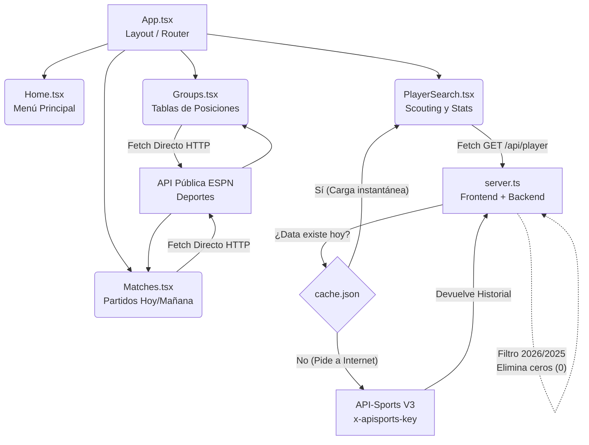

# Documentación de Arquitectura y Flujo

Este documento explica cómo funciona la aplicación en su totalidad, la relación entre los archivos y el flujo de datos. Todos los archivos clave del código fuente también cuentan con comentarios descriptivos línea por línea en las lógicas críticas.

## Componentes Principales

### 1. Backend (El Motor)
*   **`server.ts`**: Es el cerebro de la aplicación. Actúa como intermediario (Proxy) entre nuestra interfaz y los servicios de pago (API-Sports V3). Aloja nuestro sistema de purificación de datos (eliminación de estadísticas en 0) y protege nuestras claves privadas (`API_SPORTS_KEY`).
*   **`cache.json`**: Base de datos temporal ultrarrápida. El servidor guarda aquí las peticiones exitosas a API-Sports durante 24 horas para no agotar la cuota gratuita ni hacer esperar al usuario.

### 2. Frontend (La Pantalla)
*   **`src/App.tsx`**: Es el director de orquesta. No muestra mucho por sí solo, pero decide cuál "pantalla" (Vista) debe mostrarse dependiendo de dónde hizo click el usuario (Home, Matches, Groups, PlayerSearch).
*   **`src/components/Home.tsx`**: Pantalla de inicio o Dashboard. Contiene la navegación principal estructurada en un "Bento Grid" de tarjetas animadas.
*   **`src/components/PlayerSearch.tsx`**: Pantalla de Scouting Oficial. Consume los datos de nuestro **propio servidor Node.js**, muestra la galería de jugadores monitoreados en tiempo real y despliega sus estadísticas de competencia actuales.
*   **`src/components/Matches.tsx` y `src/components/Groups.tsx`**: Pantallas de calendarios y posiciones de equipos. Consumen la data directamente desde la API anónima de **ESPN** sin pasar por nuestro servidor para máxima velocidad y actualizaciones "en vivo".

---

## Modificación de Logotipos e Imágenes

Para cambiar los fondos de las ligas o el logotipo principal de la empresa, reemplaza o edita los siguientes archivos:

1. **Logo de la Empresa (Header):**
   * Ubicación física (si la quieres agregar a los archivos estáticos en local): Reemplaza la imagen en la ruta **`public/logo.png`**.
   * El código apuntará automáticamente a ella porque en `App.tsx` está referenciado como `` (La carpeta `public` actúa como el directorio raíz `/`).
   * *Aviso:* Si el framework en el que integran el código no utiliza una carpeta `public/`, coloquen el logo en una carpeta de `assets` y realicen el `import logo from './assets/logo.png';` en `App.tsx`.

2. **Imágenes de Fondos de las Ligas:**
   * Archivo a modificar: **`src/components/Home.tsx`**
   * En este archivo, en las primeras líneas al declarar la constante **`tournaments = [...]`**, encontrarán una clave llamada **`img: '...'`**.  Actualmente apunta a URL de imágenes (Unsplash). Tienen que reemplazar esa URL con el link a las imágenes que desean o importar las imágenes desde la carpeta local de assets como lo harían habitualmente en React/Vite.

---

## Ejecución en Entorno Local

Para correr el proyecto completo (Backend Node.js Express + Frontend Vite con React) en tu máquina de trabajo loca:

1. Asegúrate de tener **Node.js v18+** instalado.
2. Abre la consola en la carpeta raíz del proyecto y corrobora que el archivo `package.json` exista allí.
3. Crear el archivo **`.env`** en la carpeta principal. Asegúrate que incluya la licencia de API-Sports:
```env
API_SPORTS_KEY=tu_clave_supersecreta_aqui
```
4. Instala todas las dependencias del proyecto con:
```bash
npm install
```
5. Inicia el servidor de desarrollo utilizando TSX, el mismo ejecutará tanto el proxy exprés y react de forma colaborativa simulando el mismo patrón de producción. En consola ejecuta:
```bash
npm run dev
```
6. El proyecto debería ser visible en `http://localhost:3000`. Carga la web y corrobora en la consola de tu editor que las rutas `/api/*` y la lectura/escritura del `cache.json` estén funcionando sin errores.

---

## Diagrama de Flujo (Lógica y Datos)



## Patrones de Animación (Motion)

Utilizamos `framer-motion` (motion/react) en el Frontend.
Regla general del proyecto:
1. **Páginas enteras (Rutas):** Utilizan `<AnimatePresence>` en `App.tsx` para hacer fade-in y fade-out al cambiar.
2. **Micro-interacciones:** Los botones y tarjetas escalan a `scale: 1.02` en hover y brillan con colores de la marca.
3. **Escalonamiento (Stagger):** Los elementos en listas (como los jugadores, grupos o resultados) no aparecen de golpe, sino que entran uno por uno cayendo desde arriba suavemente.
